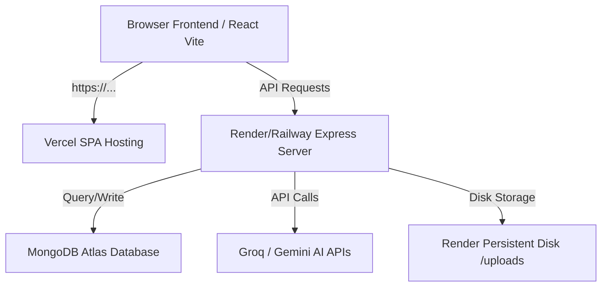

# AlumniConnect Deployment Guide

This guide details how to deploy both the frontend (React Vite) and the backend (Express API) to production while keeping them connected to your MongoDB Atlas database and AI services.

---

## Architecture Overview



---

## 1. Backend Deployment (Render or Railway)

Since the backend needs to handle uploaded identification documents (`/uploads/` directory), it is best deployed on a host that supports a continuous process and optional persistent storage. We recommend **Render** or **Railway**.

### Option A: Render Setup

1. **Create a Render Account:** Go to [render.com](https://render.com) and connect your GitHub repository.
2. **Create a Web Service:**
   - **Name:** `alumniconnect-backend`
   - **Environment:** `Node`
   - **Build Command:** `npm install` (inside the `backend/` directory)
   - **Start Command:** `node server.js`
3. **Configure Environment Variables:** In the Render dashboard under **Environment**, add:
   - `PORT` = `10000` (or let Render assign dynamically)
   - `MONGO_URI` = `mongodb+srv://...` (your Atlas connection string)
   - `JWT_SECRET` = `your_strong_secret_key`
   - `GROQ_API_KEY` = `your_groq_api_key`
4. **Persistent Disk (Required for File Uploads):**
   - Go to **Disks** -> **Add Disk**.
   - **Name:** `uploads-storage`
   - **Mount Path:** `/opt/render/project/src/backend/uploads` (or specify `./uploads`)
   - **Size:** `1 GB` (free/cheap tier)
5. **Deploy:** Render will build and deploy your Express backend, assigning it a public URL like `https://alumniconnect-backend.onrender.com`.

---

## 2. Frontend Deployment (Vercel)

Vercel is the ideal host for React/Vite applications. It is free and highly optimized for SPA builds.

1. **Create a Vercel Account:** Go to [vercel.com](https://vercel.com) and link your GitHub repository.
2. **Configure Project:**
   - **Framework Preset:** `Vite`
   - **Root Directory:** `frontend`
   - **Build Command:** `npm run build`
   - **Output Directory:** `dist`
3. **Configure Environment Variables:** Add the backend URL so the frontend knows where to send API requests:
   - `VITE_BASE_URL` = `https://alumniconnect-backend.onrender.com` (use your deployed Render URL)
4. **Client Routing (`vercel.json`):**
   - The project already contains the `frontend/vercel.json` file. This tells Vercel to rewrite all nested path requests (like `/dashboard`) back to `index.html` so you don't get 404 errors on browser page reloads.
5. **Deploy:** Hit Deploy. Vercel will output a live frontend link (e.g., `https://alumniconnect.vercel.app`).

---

## 3. MongoDB Atlas Configuration

To make sure your deployed backend can successfully talk to MongoDB Atlas:

1. **Network Access / IP Whitelisting:**
   - In MongoDB Atlas, go to **Network Access**.
   - Click **Add IP Address**.
   - Select **Allow Access from Anywhere** (`0.0.0.0/0`) or whitelist the specific outbound IPs of your Render/Railway instance. Allowing access from anywhere is recommended for serverless/hosted deployments as target server IPs can rotate.
2. **Database Seeding (Optional):**
   - You can seed your Atlas cluster with initial data (like the placement statistics, initial opportunity posts, and the admin user account `admin@nitjsr.ac.in`) by running the seed script from your terminal:
     ```bash
     cd backend
     MONGO_URI="your_mongodb_atlas_connection_string" node seedAdmin.js
     ```

---

## Verification & Testing

Once both services are up:
1. Visit your Vercel URL.
2. Test registering a new **Alumni** (using any email) or **Student** (using `@nitjsr.ac.in`).
3. Upload a document and click submit.
4. Log in as the Admin (`admin@nitjsr.ac.in` / `admin123`) to approve the new accounts.
