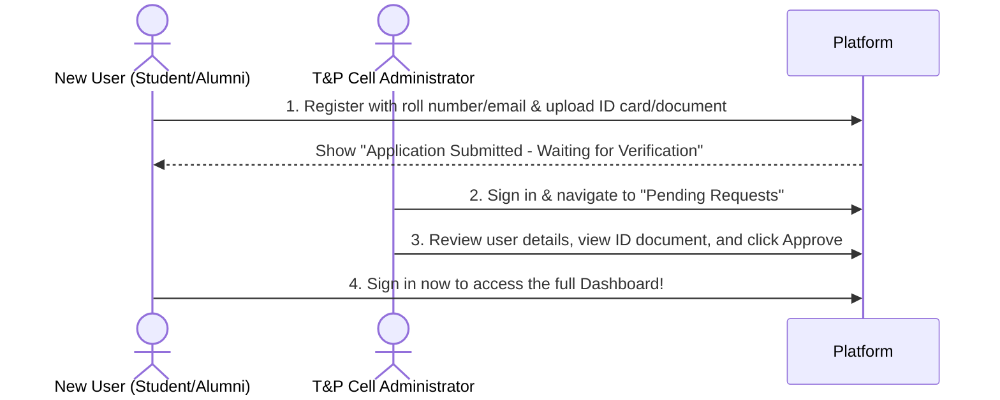

# AlumniConnect 🎓🤝

AlumniConnect is a premium, full-stack network platform designed to bridge the gap between students and verified alumni of **NIT Jamshedpur**. The application features dynamic referral request workflows, real-time platform analytics, AI-assisted resume building/ATS checking (powered by Groq), and an live, activity-driven alumni leaderboard.

---

## 🔑 Demo & Testing Credentials

Use these pre-configured accounts to instantly explore the different platform dashboards:

### 1. Administrator Account
* **Email:** `admin@nitjsr.ac.in`
* **Password:** `admin123`

### 2. Verified Student Account
* **Email:** `aditi.sharma@nitjsr.ac.in`
* **Password:** `password123`

### 3. Verified Alumni Account
* **Email:** `saksham123@gamil.com`
* **Password:** `Saksham123`

---

## ⚡ Step-by-Step Verification Testing Guide (Judges Read!)

To prevent identity theft, the application enforces a secure, manual verification process for all new registrations. Follow these steps to test this workflow:



### Testing Steps:
1. **Register a New Account:**
   - Go to the **Register** screen.
   - Choose **Student** (requires a `@nitjsr.ac.in` email) or **Alumni** (accepts any valid email format).
   - Enter your personal details and upload a verification document (ID card, registration slip, or degree certificate).
   - Submit. You will be greeted with a **waiting screen** explaining your registration is pending.
2. **Approve the Account as Admin:**
   - Log out and log in using the **Admin** credentials (`admin@nitjsr.ac.in` / `admin123`).
   - Go to the **Pending Requests** tab.
   - You will see the new application, along with a button to view their uploaded ID card/PDF.
   - Click **Approve & Grant Access** (or reject with a reason).
3. **Access the Platform:**
   - Log out of the admin panel.
   - Log in with the credentials of the account you just created.
   - You will now have full dashboard access!

---

## 🚀 Quickstart Guide (Local Development)

### Prerequisites:
* **Node.js** (v18+)
* **MongoDB** (Local instance running, or use MongoDB Atlas URI)

### 1. Backend Setup
1. Navigate to the backend folder:
   ```bash
   cd backend
   ```
2. Install dependencies:
   ```bash
   npm install
   ```
3. Set up environment variables in a `.env` file:
   ```env
   PORT=5001
   MONGO_URI="your_mongodb_connection_string"
   JWT_SECRET="your_jwt_secret"
   GROQ_API_KEY="your_groq_api_key"
   ```
4. Seed the database with test accounts & opportunities:
   ```bash
   node seedAdmin.js
   ```
5. Start the server:
   ```bash
   node server.js
   ```

### 2. Frontend Setup
1. Navigate to the frontend folder:
   ```bash
   cd ../frontend
   ```
2. Install dependencies:
   ```bash
   npm install
   ```
3. Start the Vite development server:
   ```bash
   npm run dev
   ```
4. Open `http://localhost:5173` in your browser.

---

## 🌟 Key Features

* **Manual Document Verification:** Combats identity theft by requiring students/alumni to upload official credentials (parsed/stored securely via Multer) before gaining system entry.
* **AI Career Copilot:** AI Resume Builder and ATS Checker (built with Groq & Gemini APIs) that analyzes resumes against target job descriptions and generates real-time roadmaps.
* **Real-time Leaderboard:** Dynamically calculates alumni contribution scores in real-time based on their actual platform activity (posting opportunities and approving referral requests).
* **Platform Security:** Implements role-based route guards (Admins/Alumni/Students) and JWT authentication.
